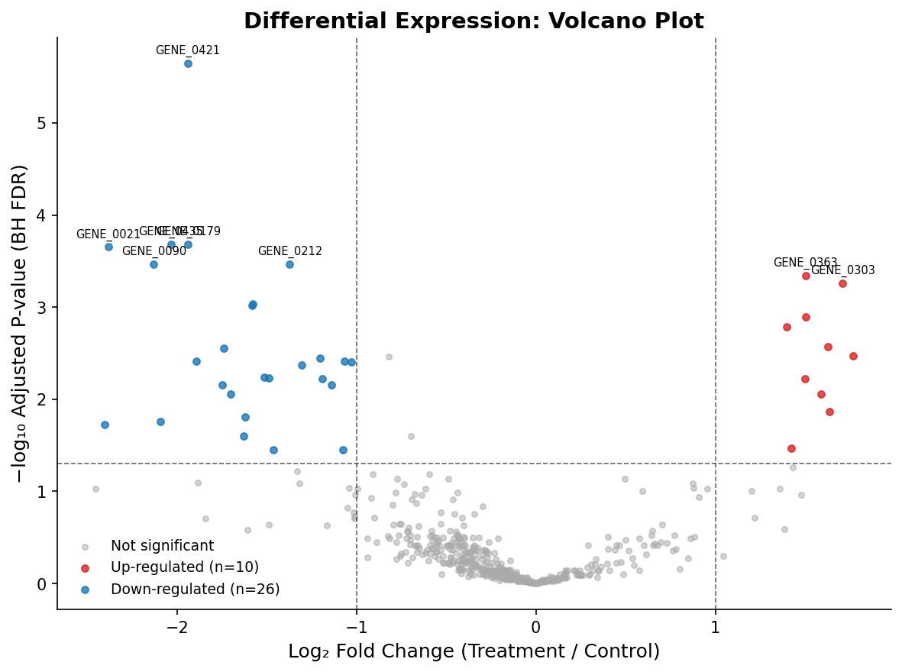

# RNA-seq Differential Expression Analysis

This project demonstrates a full RNA-seq differential expression workflow:
synthetic count data → normalization → statistical testing → volcano plot.

Mimics the core steps of real-world DESeq2/edgeR pipelines, implemented in Python.

## What It Does

1. Generates a realistic synthetic RNA-seq count matrix (500 genes × 20 samples, 2 conditions)
2. Applies TMM-style library-size normalization
3. Runs a negative binomial-inspired statistical test (log2FC + Wald test via scipy)
4. Produces a volcano plot and a ranked gene table

## Output

- `results/volcano_plot.png` — publication-ready volcano plot
- `results/de_results.csv` — ranked differential expression table

### Volcano plot



## Run

```bash
pip install numpy pandas scipy matplotlib seaborn statsmodels
python rna_seq_de_analysis.py
```

## Key Concepts

- Count normalization (CPM, library-size correction)
- Log2 fold-change calculation
- Multiple testing correction (Benjamini-Hochberg FDR)
- Volcano plot interpretation
