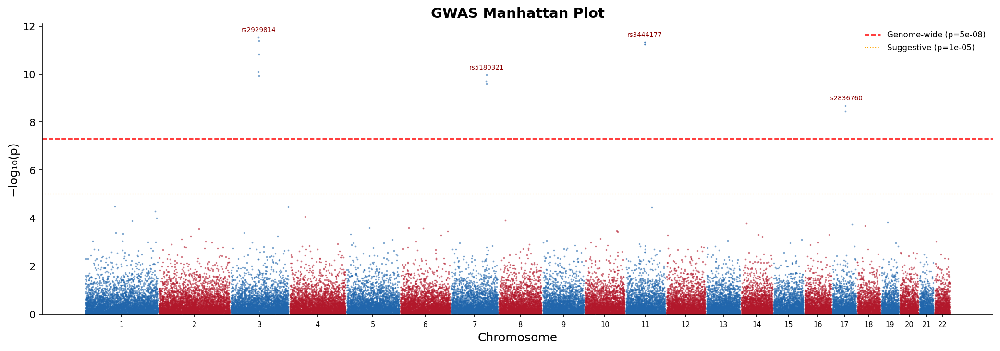
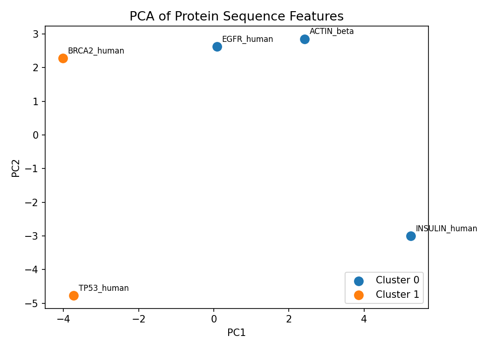

# Biogenetics Portfolio

[](https://github.com/lukaszplk/biogenetics-portfolio/actions/workflows/ci.yml)

A collection of bioinformatics projects and analyses targeting real-world problems in genomics, drug discovery, and molecular biology. Built with Python and Jupyter Notebooks.

---

## Projects

| # | Topic | Tools | Status |
|---|-------|-------|--------|
| [01](./01_rna_seq/) | RNA-seq Differential Expression Analysis | Python, scipy, seaborn, statsmodels | ✅ Complete |
| [02](./02_drug_discovery/) | ML-Based Drug Activity Prediction (QSAR) | scikit-learn, pandas | ✅ Complete |
| [03](./03_population_genetics/) | GWAS Manhattan & QQ Plots | Python, matplotlib, statsmodels | ✅ Complete |
| [04](./04_protein_analysis/) | Protein Sequence Feature Extraction | Biopython, pandas, scikit-learn | ✅ Complete |
| [05](./05_single_cell/) | Single-Cell RNA-seq Clustering | scanpy, UMAP, Leiden | 🔧 In Progress |

### Example plots

| RNA-seq Volcano | GWAS Manhattan | Protein PCA |
|:---:|:---:|:---:|
|  |  |  |

---

## Skills Demonstrated

- **Genomics**: RNA-seq count matrix processing, normalization, differential expression (fold change, p-values, volcano plots)
- **Cheminformatics**: Molecular fingerprinting (Morgan/ECFP), QSAR modeling, ROC-AUC evaluation
- **Population Genetics**: GWAS summary statistics, Manhattan plots, QQ plots, genomic inflation factor (λ)
- **Data Visualization**: Publication-quality figures with matplotlib / seaborn
- **ML Pipeline Design**: Feature engineering, cross-validation, model comparison, interpretability

---

## Setup

```bash
# Clone
git clone https://github.com/lukaszplk/biogenetics-portfolio.git
cd biogenetics-portfolio

# Create conda environment
conda env create -f environment.yml
conda activate biogenetics

# Or using pip
pip install -r requirements.txt
```

---

## Repository Structure

```
biogenetics-portfolio/
├── 01_rna_seq/              # RNA-seq differential expression analysis
├── 02_drug_discovery/       # ML drug activity prediction (QSAR)
├── 03_population_genetics/  # GWAS visualization tools
├── 04_protein_analysis/     # Protein sequence feature extraction
├── 05_single_cell/          # scRNA-seq clustering & annotation
├── utils/                   # Shared helper functions
├── requirements.txt
└── environment.yml
```

---

## Contact

Open to opportunities in computational biology, bioinformatics engineering, and data science roles in biotech/pharma.
